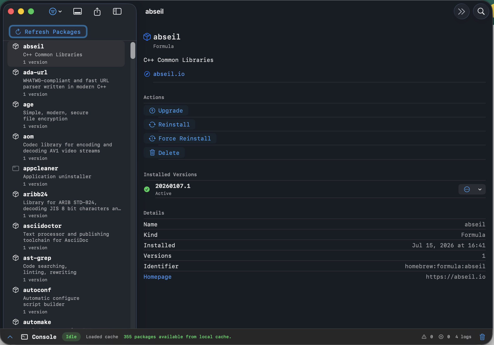
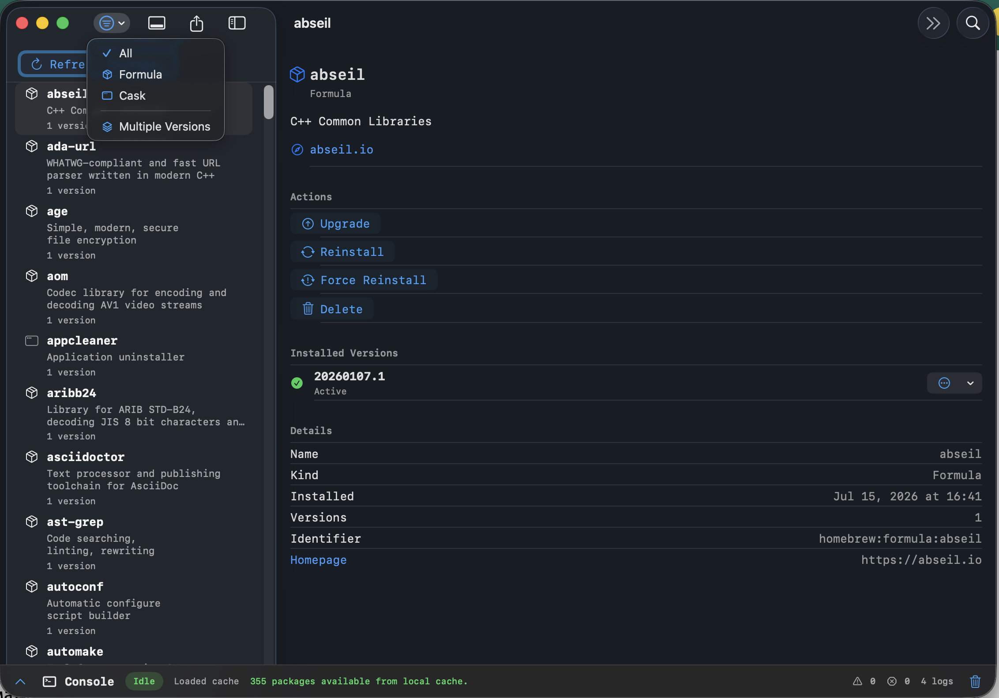

# Browsing Packages

Find installed Homebrew formulae and casks quickly.

## Overview

The package browser opens as a two-column SwiftUI split view. The sidebar lists installed packages, while the detail column keeps the selected package visible for inspection and actions.

`PackageListView` shows cached packages immediately when SwiftData has a previous refresh available. If the cache is empty and the Homebrew provider is enabled, `PackageLibrary` starts a live refresh with `brew info --json=v2 --installed`.

The browser supports:

- Search across package names and summaries.
- Filtering by formula or cask.
- A multiple-versions filter for packages that need cleanup or version review.
- Selection repair when filters or refreshes change the visible package list.
- Provider-aware empty states when Homebrew is disabled.

## Data Flow

`PackageLibrary` owns the observable list state and publishes `filteredPackages` to the view. Live refreshes flow through `HomebrewServicing`, then the resulting `InstalledPackageDTO` snapshots are persisted as `BrewPackage` and `BrewVersion` records for fast startup on the next launch.

## Related Types

- ``PackageListView``
- ``PackageLibrary``
- ``InstalledPackageDTO``
- ``ManagedPackageKind``
- ``BrewPackage``
- ``BrewVersion``
