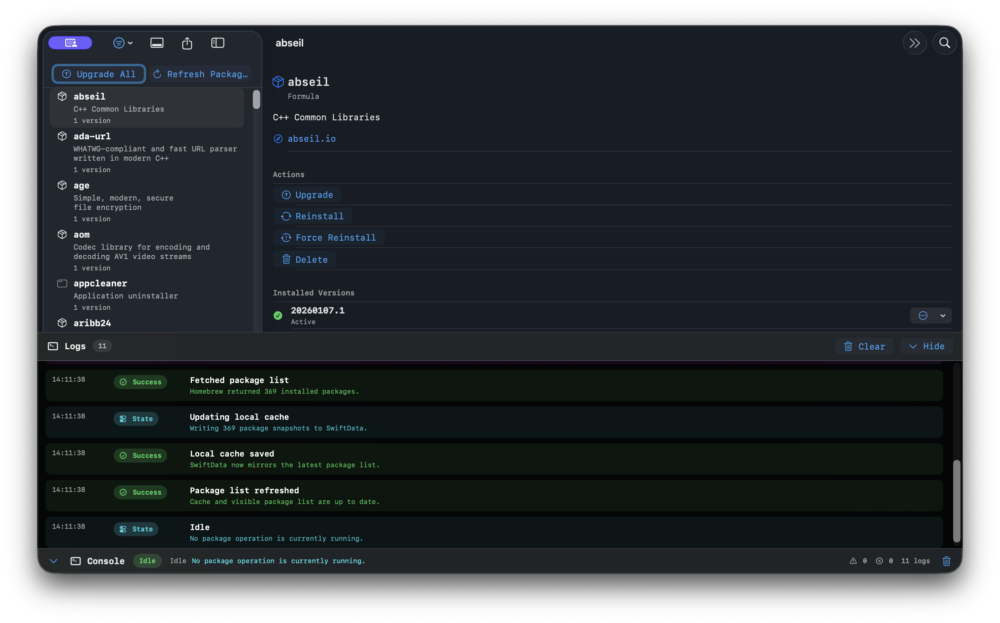

# Managing Packages

Run Homebrew maintenance tasks from the selected package detail view.

## Overview

The detail pane surfaces the selected package's metadata, installed versions, and available package operations. Actions are delegated back to `PackageLibrary`, which logs the command, calls the active package service, and refreshes package state when the command completes.

The Discover catalog also delegates new installations to `PackageLibrary`. Formulae use `brew install --formula`, casks use `brew install --cask`, and tap-provided packages retain their fully qualified `user/repository/package` names through command execution and installed-state refresh.

Package-level actions include:

- Upgrade
- Reinstall
- Force Reinstall
- Delete

The Packages menu and package-list toolbar also provide **Upgrade All Packages**. The workflow always runs `brew update` first so Homebrew and formula metadata are current. Only after that mandatory step succeeds does the app run `brew upgrade --no-ask` with no package arguments, upgrading every outdated, unpinned formula and cask. When the cleanup preference is enabled, the app follows a successful upgrade with `brew cleanup` before refreshing the package list.

As Homebrew moves between packages, the list records a green check for completed upgrades. If the command reports a package-specific failure, that named package receives a red error icon and tint with the Homebrew message available as a tooltip, even when stdout and stderr arrive close together. These results describe the latest upgrade operation in the current app session and remain visible after the package refresh.

Version-level actions include:

- Make Active
- Upgrade Package
- Delete Version

Every command appends structured log entries before and after execution. During a bulk upgrade, the console dock streams meaningful Homebrew milestones such as the package currently being upgraded. Output from both command streams is delivered in order, and the app waits for queued progress before it marks the command complete, so a final unterminated line or late failure is not lost. The dock and log-state badges animate as their state changes while respecting Reduce Motion. The expanded log panel shows timestamps, severity, command details, warnings, and failures.

Some cask installers and uninstallers require administrator access. For package upgrades, reinstalls, and removals, the app supplies Homebrew with a temporary, user-only `SUDO_ASKPASS` helper that presents a native hidden-password dialog. The password passes directly to `sudo`; it is not retained in app state or written to logs, and the helper is removed when the command exits.

## Command Mapping

On macOS, `HomebrewCLIService` maps app actions to Homebrew commands. The service launches Homebrew through `/bin/zsh -lc` so common login-shell Homebrew setup is available, applies noninteractive Homebrew environment flags, drains stdout and stderr continuously, and terminates commands that exceed the timeout.

## Related Types

- ``PackageDetailView``
- ``PackageAction``
- ``PackageVersionAction``
- ``PackageLibrary``
- ``HomebrewCLIService``
- ``PackageLogEntry``
