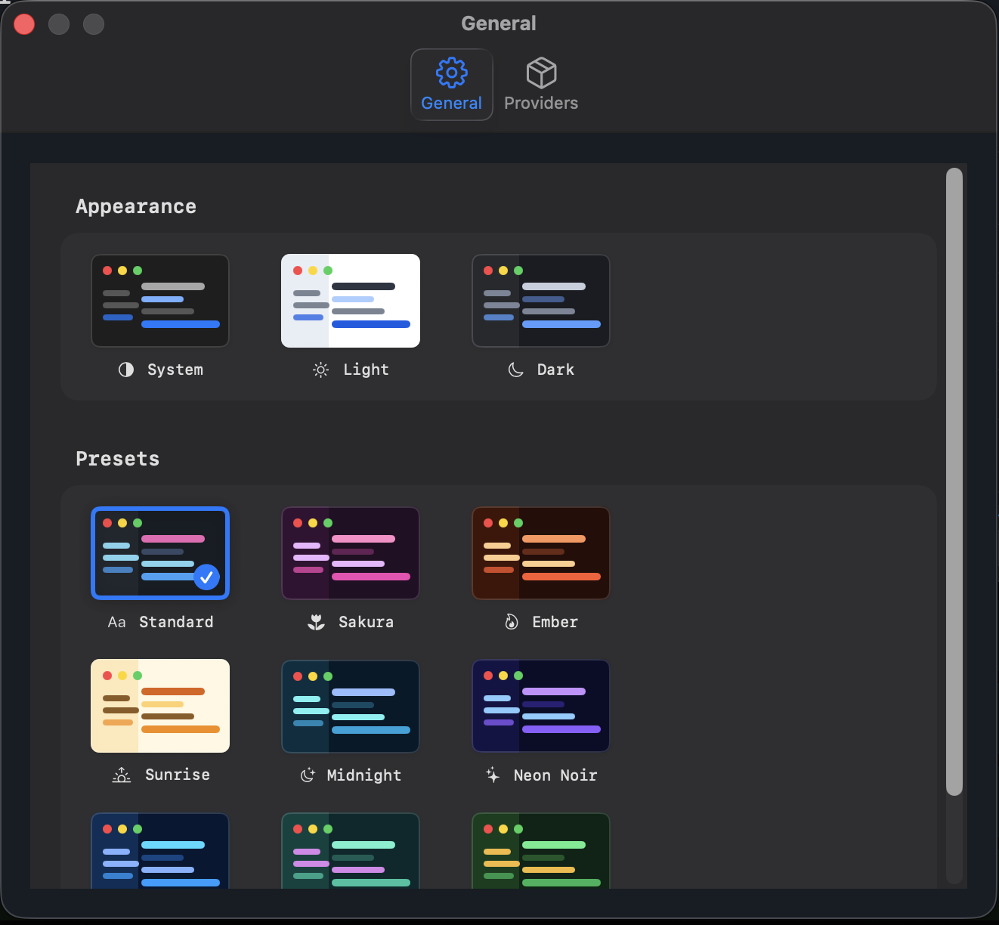
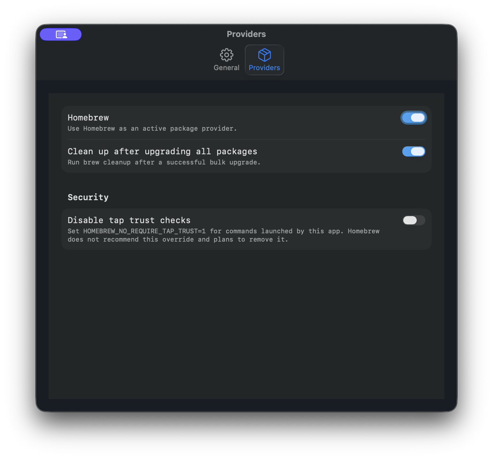

# Settings and Export

Customize the app appearance, control package providers, and export inventory data.

## Overview

HomebrewApp includes a macOS Settings scene with native tabbed panes. General settings control the app appearance, while provider settings let users enable or disable the Homebrew provider without deleting cached package data.

Appearance choices are persisted with `@AppStorage` and applied to app windows through the shared appearance environment. The settings UI includes system light/dark choices and preset palettes previewed in the same split-view layout used by the main app.

Provider settings also include **Clean up after upgrading all packages**, which is enabled by default. When enabled, a successful bulk upgrade is followed by a full `brew cleanup`; disabling it leaves outdated versions and cached downloads for Homebrew's normal cleanup policy.

The **Disable tap trust checks** security option is off by default. Enabling it sets `HOMEBREW_NO_REQUIRE_TAP_TRUST=1` only for Homebrew commands launched by the app. This allows formulae, casks, and commands from untrusted taps to load, so prefer trusting only the specific third-party packages you need whenever possible.

## JSON Export

The package list can be exported from the toolbar as `homebrew-packages.json`. `PackageLibrary` encodes a `PackageExportDocumentPayload` with the export timestamp, package manager name, and current package snapshots. `PackageExportDocument` then hands the formatted JSON data to SwiftUI's file exporter.

## Related Types

- ``AppSettingsView``
- ``AppearancePreference``
- ``PackageExportDocument``
- ``PackageExportDocumentPayload``
- ``PackageLibrary``
